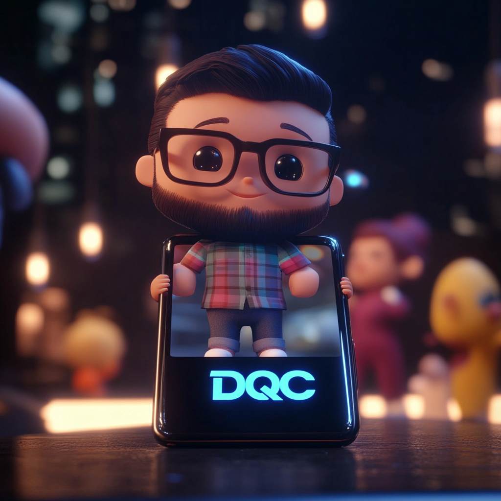

# Welcome to the Digital Quantum Clone Project!

🌟 **What is the Digital AI Mini-Me Project?**

The Digital AI Mini-Me Project is an innovative initiative to build a digital representation of a person. This AI-powered avatar can:

<figure><figcaption>
Representation of the core DQC philosophy.
</figcaption></figure>

* Mimic your conversational style and knowledge.
* Assist in answering questions in your areas of expertise.
* Act as a virtual assistant or consultant for your personal or professional needs.
* Evolve and learn to better represent you over time.

Think of it as a virtual, miniaturized version of yourself, accessible anytime and anywhere!

### 🛠 **Core Features**

1. **Personalized AI**:
   * Tailored to your unique personality, tone, and expertise.
   * Based on training data provided by you (e.g., documents, recordings, preferences).
2. **Natural Language Processing (NLP)**:
   * Engages in realistic, human-like conversations.
   * Understands and responds to complex queries.
3. **Self-Learning Capabilities**:
   * Continuously improves and adapts to new information.
   * Learns from feedback to refine its behavior and responses.
4. **Omnichannel Integration**:
   * Accessible via web, mobile, and other communication platforms.
   * Can be deployed as a chatbot, virtual assistant, or standalone application.
5. **Privacy and Security**:
   * Ensures that personal data and interactions are securely stored and managed.
   * Fully compliant with GDPR and other privacy regulations.

### 📈 **Why Build a Digital Quantum Clone?**

The Digital AI Mini-Me has endless applications across various domains:

* **Personal Productivity**:
  * Automate repetitive tasks.
  * Manage schedules and reminders.
* **Professional Assistance**:
  * Handle client interactions.
  * Share expertise in your stead when you're unavailable.
* **Content Creation**:
  * Generate responses, blogs, or social media posts aligned with your tone.
* **Learning & Training**:
  * Teach others using your expertise.
  * Serve as a mentor or guide in specific fields.
* **Entertainment**:
  * Interact with friends or fans in an engaging, virtual format.🚀 **Project Goals**

### 🚀 **Project Goals**

* To create a realistic and functional AI representation of a person.
* To enhance productivity and personalization through AI-powered solutions.
* To push the boundaries of human-AI interaction and collaboration.

### 📚 **How to Use this Documentation**

This documentation is structured to guide you through:

1. **Getting Started**: Setting up and understanding the project basics.
2. **Development Guide**: Technical documentation for building your AI Mini-Me.
3. **Customization**: Tools and methods to personalize your avatar.
4. **Deployment**: Steps to launch your AI on preferred platforms.
5. **FAQs**: Common questions and troubleshooting tips.
6. **Future Enhancements**: Ideas and features planned for future versions.

## Welcome to the Digital AI Mini-Me Project!

Welcome to the documentation for the **Digital AI Mini-Me Project**. This GitBook is your comprehensive guide to understanding, developing, and utilizing a personalized AI-powered digital avatar of yourself. This project leverages cutting-edge AI technologies to create a digital version of you that can interact, learn, and represent your unique personality and expertise.

***

### 🌟 **What is the Digital AI Mini-Me Project?**

The Digital AI Mini-Me Project is an innovative initiative to build a digital representation of a person. This AI-powered avatar can:

* Mimic your conversational style and knowledge.
* Assist in answering questions in your areas of expertise.
* Act as a virtual assistant or consultant for your personal or professional needs.
* Evolve and learn to better represent you over time.

Think of it as a virtual, miniaturized version of yourself, accessible anytime and anywhere!

***

### 🛠 **Core Features**

1. **Personalized AI**:
   * Tailored to your unique personality, tone, and expertise.
   * Based on training data provided by you (e.g., documents, recordings, preferences).
2. **Natural Language Processing (NLP)**:
   * Engages in realistic, human-like conversations.
   * Understands and responds to complex queries.
3. **Self-Learning Capabilities**:
   * Continuously improves and adapts to new information.
   * Learns from feedback to refine its behavior and responses.
4. **Omnichannel Integration**:
   * Accessible via web, mobile, and other communication platforms.
   * Can be deployed as a chatbot, virtual assistant, or standalone application.
5. **Privacy and Security**:
   * Ensures that personal data and interactions are securely stored and managed.
   * Fully compliant with GDPR and other privacy regulations.

***

### 📈 **Why Build a Digital AI Mini-Me?**

The Digital AI Mini-Me has endless applications across various domains:

* **Personal Productivity**:
  * Automate repetitive tasks.
  * Manage schedules and reminders.
* **Professional Assistance**:
  * Handle client interactions.
  * Share expertise in your stead when you're unavailable.
* **Content Creation**:
  * Generate responses, blogs, or social media posts aligned with your tone.
* **Learning & Training**:
  * Teach others using your expertise.
  * Serve as a mentor or guide in specific fields.
* **Entertainment**:
  * Interact with friends or fans in an engaging, virtual format.

***

### 🚀 **Project Goals**

* To create a realistic and functional AI representation of a person.
* To enhance productivity and personalization through AI-powered solutions.
* To push the boundaries of human-AI interaction and collaboration.

***

### 📚 **How to Use this Documentation**

This GitBook is structured to guide you through:

1. **Getting Started**: Setting up and understanding the project basics.
2. **Development Guide**: Technical documentation for building your AI Mini-Me.
3. **Customization**: Tools and methods to personalize your avatar.
4. **Deployment**: Steps to launch your AI on preferred platforms.
5. **FAQs**: Common questions and troubleshooting tips.
6. **Future Enhancements**: Ideas and features planned for future versions.

***

### 🔗 **Quick Links**

* Setup Guide
* API Documentation
* Customization Tools
* Support & Community

Dive in and start creating your own **Digital Quantum Clone** today! Let’s bring your unique personality to the digital world.

